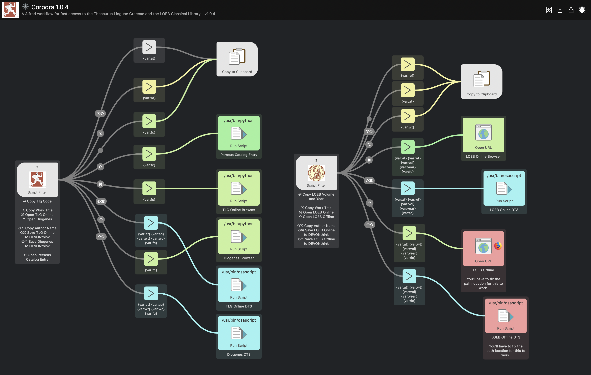

# Corpora - Workflows for fast access to the _Thesaurus Linguae Graecae_ and the _LOEB Classical Library_  

"TLG" will start a search for tlg texts and give you the following options:

- open the text online/offline;
- create a bookmark in DEVONthink 3 leading to the text;
- open the associated entry at the Perseus Catalog;
- copy the author/work ID.

"LOEB" will start a search for LOEB volumes and give you the following options: 

- open it online/offline;
- create a bookmark in DEVONthink 3 leading to the text;
- copy the volume ID.

"DK" will start a search for authors and fragments in Diels-Kranz' Die Fragmente der Vorsokratiker and give you the option to open them online at Daphnet.

# Credits

## Data

There are 10160 search items in the database.

This project uses data scraped from the TLG website and compiled by myself & data made available by Stephen Margheim at https://github.com/fractaledmind/Classical-Studies-Resources

## Icons

The Perseus logo:
Source: http://www.perseus.tufts.edu/hopper/
Perseus is a non-profit enterprise, located in the Department of the Classics, Tufts University.

The LOEB logo:
Source: https://www.loebclassics.com/page/logo
The Logo of the Loeb Classical Library®, featuring Athena, goddess of wisdom, and Nike, goddess of victory.

Flat Icon's "Settings" Icon
Source: https://www.flaticon.com
Flat Icon offers many great icons for free on the sole condition that you reference the source, which I gladly do.

## "I Sheet You Not"

Source: http://www.deanishe.net/i-sheet-you-not/
This workflow was re-built using a workflow generator called "I Sheet You Not" by Dean Jackson.

WARNING: Databases may be subject to licensing restrictions.

